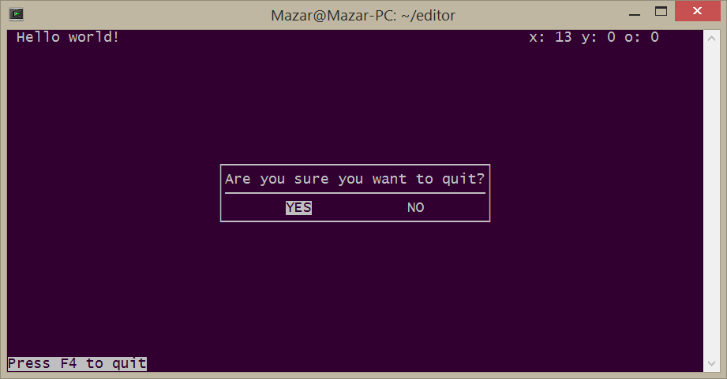

Text Editor
===========

Functional lightweight text editor written in C using ncurses.

## How to use:

    usage: text [ file ]

* F4 quits (after prompt)
* F5 saves the current file (untitled.txt is the default name)
* F6 saves the current file and allows you to specify the filename.
(WARNING: no confirmation screen or error checking yet).

## Current issues:

* Code could be organized better
* Some arguments/variables don't do anything
* Tabs are always 4 spaces.  This is likely a permanent solution.
* Need to add copy/paste/undo.
